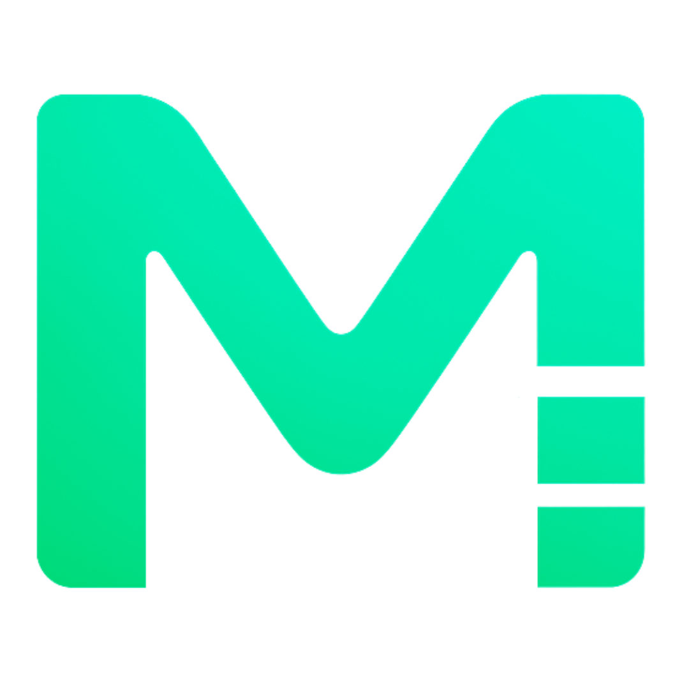

  <!-- PROJECT LOGO -->
  <br />
  <div align="center">
    <a href="https://github.com/github_username/moodsy">
      
    </a>

  <h3 align="center">Moodsy – Chrome Extension</h3>

<p align="center">
  Collect. Organize. Create Moodboards.<br />
  Save design inspirations from across the web into one place.
  <br />
  <br />
  <a href="https://github.com/github_username/moodsy/issues">Report Bug</a>
  ·
  <a href="https://github.com/github_username/moodsy/issues">Request Feature</a>
</p>

  </div>


  <!-- TABLE OF CONTENTS -->
  <details>
    <summary>Table of Contents</summary>
    <ol>
      <li><a href="#about-the-project">About The Project</a></li>
      <li><a href="#features">Features</a></li>
      <li><a href="#getting-started">Getting Started</a></li>
      <li><a href="#usage">Usage</a></li>
      <li><a href="#contact">Contact</a></li>
    </ol>
  </details>


  <!-- ABOUT THE PROJECT -->
  ## About The Project
  ### 🌍 The Problem
  Designers get inspiration everywhere — Dribbble, Behance, Pinterest, Instagram.  
  But ideas are scattered across bookmarks, screenshots, and tabs.  
 ***Result: the best inspiration gets lost***

  ### 💡 The Solution
  Moodsy is a Chrome Extension that lets you **save, tag, and organize** inspiration images.  
  You can group them into **folders** and generate **moodboards** to revisit or share.


  <!-- FEATURES -->
  ## Features
  - 🖱️ **Right-click Save** → Instantly capture images from any site  
  - 🗂️ **Folders** → Organize inspirations by project or theme  
  - 🏷️ **Tags** → Add searchable keywords  
  - 🖼️ **Moodboards** → Create curated boards with one click  
  - 💾 **Persistent Storage** → Saved locally in Chrome  


  <!-- GETTING STARTED -->
  ## Getting Started

  Follow these steps to install Moodsy locally in Chrome:

  1. Clone the repo:
     ```sh
     git clone https://github.com/github_username/moodsy.git
     ```
  2. Open Chrome and navigate to:
     ```
     chrome://extensions/
     
     ```
  3. Enable **Developer mode** (toggle in the top right).
  4. Click **Load unpacked** and select the `Moodsy-main/` folder (where `manifest.json` is).
  5. The extension icon will appear in your toolbar 🎉


  <!-- USAGE -->
  ## Usage

  - **Save an Image** → Right-click any image → choose **Save to Moodsy**  
  - **Popup Dashboard** → Manage folders, tags, and images from the extension popup  
  - **Moodboard Page** → Open and view moodboards grouped by folders

  ## 📸 Screenshots
  
  ### Easily accessible from the top-right corner of your browser.
  

  ### Save images, organize them into folders, and manage tags right inside the popup.
  

  ### Curate your inspirations into beautiful moodboards, grouped by folders.
  


<!-- CONTACT -->
## Contact

**Manish Vaishnav** – [LinkedIn](https://www.linkedin.com/in/manish-vaishnav-4659b0256)  
**Email** – manish.uiux02@gmail.com


  

  
